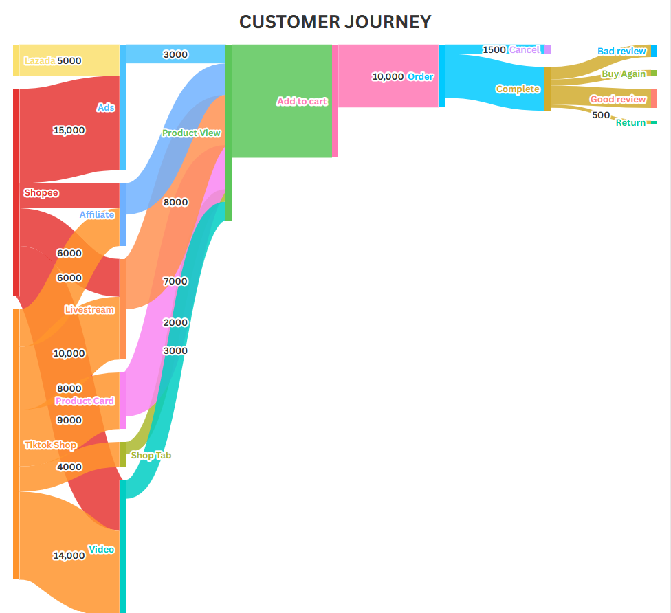

# E-commerce Customer Journey Analytics

## Shop Problem

Shop lacked a centralized view of the customer journey across Shopee, TikTok Shop, and Lazada, making it difficult to identify what drives changes in traffic and conversion, where customers drop off, and which touchpoints contribute to sales.

## Suggested Solution — Core Insight

The Customer Journey is designed to reveal **"where traffic, marketing effort, and customers are being lost before they become revenue."**

By consolidating customer paths across multiple platforms and touchpoints into a single Sankey Diagram, sellers can identify key drop-off stages and prioritize where to optimize.

A **time filter** further turns the journey into a continuous decision-making tool by allowing sellers to monitor whether:

- A specific stage is improving or deteriorating over time.
- Recent actions or campaigns have reduced drop-off rates.
- Optimization efforts are actually improving conversion.

This shifts Customer Journey from a **"view-only report"** into a tool that supports **continuous optimization and data-driven decision making**.

## Customer Journey Research

Before working with the available data, I researched the e-commerce customer journey and marketing touchpoints to understand the complete customer path independently of data availability.

.png)

The research mapped the journey from **Awareness → Consideration → Conversion → Retention & Repurchase**, including potential touchpoints such as search, ads, social media, product pages, cart, checkout, and repurchase.

## Data

Data was sourced from the APIs of Shopee, TikTok Shop, and Lazada using API credentials provided by the merchant. The Data Engineering team handled data extraction and storage, while my role focused on reviewing API documentation, identifying relevant attributes, and selecting the data required to construct the Customer Journey.

### Example API & Data Mapping

| Stage | Source | Destination | Value | Description | Data for Value (Metric — API Used) |
|---|---|---|---:|---|---|
| Reach | Shopee | Ads | 15,000 | Number of times the product was displayed through Shopee Ads. | `metric_list(Impression)` — `ads.get_product_campaign_daily_performance` WHERE `ad_name=? AND date=?` |
| Reach | Shopee | Video | 8,000 | Number of views generated by Shopee video content featuring the product. | `views` — `v2.video.get_video_performance_list` JOIN `v2.video.get_video_detail_product_performance` ON `post_id` WHERE `item_id=? AND start_date=? AND end_date=?` |
| Reach | TikTok Shop | Product Card | 9,000 | Number of times the product card was displayed to potential customers. | `seller_product_card_performance(product_impressions)` — `Analytics/Get Shop Product Performance List` WHERE `product(id)=? AND startDate=? AND endDate=?` |
| Reach | TikTok Shop | Shop Tab | 4,000 | Number of product impressions generated through the shop tab. | `shop_tab_performance(shop_tab_product_impressions)` — `Analytics/Get Shop Product Performance List` WHERE `product(id)=? AND startDate=? AND endDate=?` |
| Reach | TikTok Shop | Video | 14,000 | Number of product impressions generated through TikTok Shop video content. | `seller_video_performance(product_impressions)` — `Analytics/Get Shop Product Performance List` WHERE `product(id)=? AND startDate=? AND endDate=?` |
| Reach | Lazada | Ads | 5,000 | Number of product impressions generated through Lazada Ads. | `Impressions` — `/sponsor/solutions/report/getDiscoveryReportCampaign` WHERE `campaignName=? AND startDate=? AND endDate=?` |
| Reach | Shopee | Livestream | 6,000 | Number of views generated through Shopee livestream sessions featuring the product. | `views` — `livestream.get_session_metric` JOIN `livestream.get_session_item_metric`, `get_session_detail` BY `session_id` WHERE `list(item(item_id))=? AND start_time=? AND end_time=?` |
| Reach | TikTok Shop | Livestream | 10,000 | Number of product impressions generated through TikTok Shop livestreams. | `seller_live_performance(product_impressions)` — `Analytics/Get Shop Product Performance List` WHERE `product(id)=? AND startDate=? AND endDate=?` |
| Reach | Shopee | Affiliate | 4,000 | Number of views generated by affiliate content promoting the product. | `affiliate_list(top_popular_contents(view_count))` — `AMS > v2.ams.get_managed_affiliate_list` JOIN `v2.ams.get_affiliate_performance` ON `affiliate_id` WHERE `item_id=? AND start_date=? AND end_date=?` |
| Reach | TikTok Shop | Affiliate | 6,000 | Number of views generated by affiliate creator content featuring the product. | `creator_content_statistics(view_count)` — `Affiliate partner (Get Affiliate Campaign Creator Product Content Statistics)` WHERE `product_id=? AND content_end_date=? AND publish_date=?` |
| Engagement | Ads | Product View | 3,000 | Number of product clicks generated from advertising campaigns. | `metric_list(Clicks)` — `ads.get_product_campaign_daily_performance` WHERE `ad_name=? AND date=?` |
| Engagement | Shop Tab | Product View | 2,000 | Number of product clicks generated through the shop tab. | `shop_tab_performance(shop_tab_product_clicks)` — `Analytics/Get Shop Product Performance List` WHERE `product(id)=? AND startDate=? AND endDate=?` |
| Engagement | Product Card | Product View | 7,000 | Number of clicks on the product card that led users to the product page. | `seller_product_card_performance(product_clicks)` — `Analytics/Get Shop Product Performance List` WHERE `product(id)=? AND startDate=? AND endDate=?` |
| Engagement | Video | Product View | 3,000 | Number of product clicks generated from video content across supported platforms. | `product_clicks` — `video.get_video_detail_product_performance` WHERE `item_id=?` + `seller_video_performance(product_clicks)` — `Analytics/Get Shop Product Performance List` WHERE `product(id)=? AND startDate=? AND endDate=?` + `Clicks` — `/sponsor/solutions/report/getDiscoveryReportCampaign` WHERE `campaignName=? AND startDate=? AND endDate=?` |
| Engagement | Livestream | Product View | 8,000 | Number of product clicks generated during livestream sessions. | `metric(item_clicks)` — `livestream.get_session_metric` WHERE `item_id=?` + `product(seller_live_performance(product_clicks))` — `Analytics/Get Shop Product Performance List` WHERE `product(id)=? AND startDate=? AND endDate=?` |
| Engagement | Affiliate | Product View | 5,000 | Number of product clicks generated through affiliate content. | `Clicks` — `v2.ams.get_affiliate_performance` JOIN `v2.ams.get_managed_affiliate_list` ON `affiliate_id` WHERE `item_id=? AND start_date=? AND end_date=?` + `product(affiliate_total_performance(product_clicks))` — `Analytics/Get Shop Product Performance List` WHERE `product(id)=? AND startDate=? AND endDate=?` |

> More API mappings are available in the project documentation.

## Result

Interactive Sankey Diagram visualizing customer paths across platforms and touchpoints, with key metrics for identifying drop-off stages.

**[View Interactive Visualization →](https://public.flourish.studio/visualisation/29432295/)**

### Visualization Refinement

Based on feedback from my manager and team, I identified limitations in the initial visualization, particularly in how clearly **drop-off rates** were communicated.

The following visualization was used as a **design reference** because it provides a clearer representation of drop-off changes across different stages.

**Reference:** [Customer Journey - Sankey Diagram by Kaushalya Punchihewa on Dribbble](https://dribbble.com/shots/25760761-Customer-Journey-Sankey-Diagram)

The goal of this refinement was to move the visualization from simply showing **"where customers go"** to helping sellers understand **"where customers are lost and where optimization should be prioritized."**

## Tools

- PostgreSQL
- DBeaver
- E-commerce APIs
- Flourish

## References

- [Shopee Open API Documentation](https://open.shopee.com/)
- [TikTok Shop Partner Center API Documentation](https://partner.tiktokshop.com/docv2/page/get-authorized-category-assets-202405)
- [Lazada Open Platform API Documentation](https://open.lazada.com/apps/doc/api)
